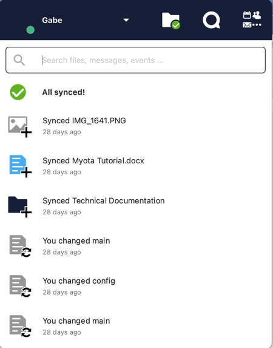

# Myota bucketZero Desktop Client

The bucketZero Desktop Client is a tool to synchronize files locally with your computer. Note: bucketZero can also be mapped as a drive letter withouth the client.

- [**bucketZero Windows Client**](https://alpha.bucketzero.cloud/index.php/s/MZwxHz8ERn2EqJB/download/bucketZeroClient-202304.msi)
- [**bucketZero macOS Client**](https://alpha.bucketzero.cloud/index.php/s/cTpizFNGYiasNgw/download/bucketZero-202304.pkg)

- [**bucketZero Android Client**](https://play.google.com/store/apps/details?id=com.myotainc.bucketzero.android.client)

    

